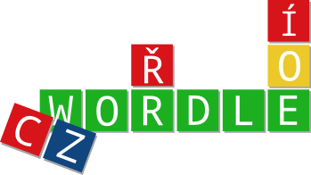
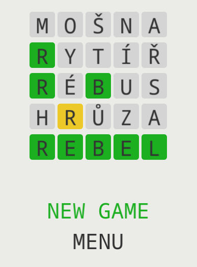

# čwordle _[czwordle]_

<p align="center">
  
</p>

A Czech port of the popular word game [wordle](https://www.powerlanguage.co.uk/wordle/).

Can be played online in the browser [here on itch.io](https://mamoot.itch.io/czwordle).

<p align="center">
  
</p>

## Dictionary

The program is not provided with a dictionary. It expects a file called `jmena.txt` in the root directory. The file should have the following structure:

1. one word per one line
2. corpus-like tags are allowed after a forward slash `/`

Example:

```
abeceda/ZQ
pivo/MQR
kozel/PIV
```

The dictionary (or more precisely the corpus) can be in any language supported by UTF-8 (which is pretty much every language), but the letter hints only contain letters of the Czech alphabet.

The dictionary I use is not provided since I have not looked into its license yet. It can be obtained and generated by following the steps in [this blogpost (in Czech language)](http://szj.cz/seznam-ceskych-podstatnych-jmen/).

## Development

### To build

Follow [macroquad's README](https://github.com/not-fl3/macroquad) to build, using:

```
rustup target add wasm32-unknown-unknown
cargo build --target wasm32-unknown-unknown
```

### To pack for `itch.io`

Create a zip file containing a folder with:

- `data/` - a folder containing the dictionary, see the Dictionary chapter
- `ttf/` - a folder containing the font(s)
- `czwordle.wasm` - found in `target/wasm32-unknown-unknown` after build
- `index.html`

Upload this zip file to itch.io.
